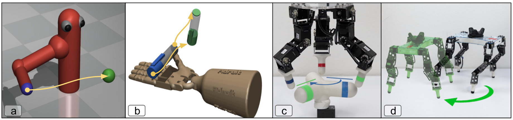
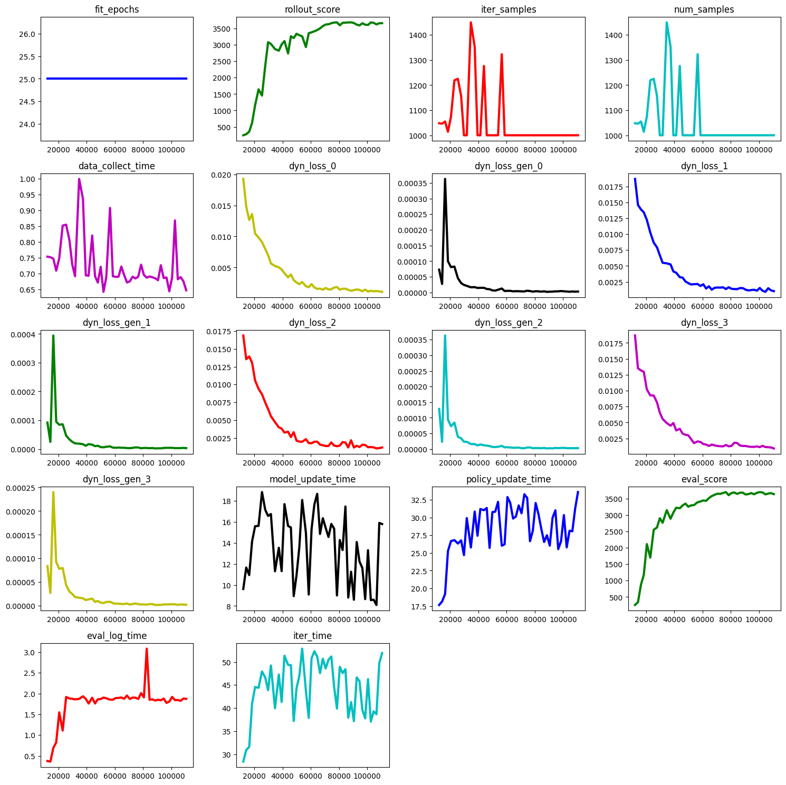

# Game-MBRL: Stable Model-Based RL

<td></td>
<p align="center">A subset of tasks studied in the paper</p>

The code for the game theoretic MBRL (model-based NPG) project builds on top of the `mjrl` framework. In this tutorial, we will go through the setup instructions and a quick illustrative example for using the MBRL code.

- Setup **mjrl** -- detailed instructions can be found here [here](https://github.com/aravindr93/mjrl/tree/v2/setup). Note importantly that you have to be on the **v2** branch.

- After setting up `mjrl`, the MBRL code can be run using the `run_model_based_npg.py` file. We suggest looking at this file in addition to an example config file to obtain an idea about the required inputs and format. An example experiment on the `Hopper-v3` environment can be run using the below command:
```
CUDA_VISIBLE_DEVICES=0 python run_model_based_npg.py --output Hopper-v3-pal-example --config configs/hopper_v3_pal.txt
```
- **NOTE:** The above example config assumes a machine with available GPU. If the machine does not have GPU (or if CUDA enabled pytorch is not compiled), you can change the `device` flag in the `configs/hopper_v3_pal.txt` to `cpu` to run the code. We recommend the use of a GPU for fast experiments.

- The job directory (`Hopper-v3-pal-example` in the above case) will contain experiment logs as well as periodic saving of learned policies. The experiment results can be quickly explored by using a plotting script included with `mjrl`.
```
python ../../mjrl/utils/explore_results.py --output Hopper-v3-pal-example/plot.png --data Hopper-v3-pal-example/logs/log.pickle --xkey num_samples
```

- An example of the above produces the following plot. The x axis is the number of samples environment interactions (samples). Look for the train_score and eval_score plots which are the performances of the Gaussian policy and the mean of the Gaussian policy respectively. As we can see, the PAL setting of model-based NPG leads to highly sample efficient learning of a successful policy. 

<td></td>

## Notes on Reward and Termination Functions

- In the above `Hopper-v3` example (from Gym), we also passed on a file that provides rewards and termination functions. Typically these functions are known for most applications and we should make use of it. 
- If for some applications, reward functions are unknown or unavailable, the `config_file` can be modified to have `learn_reward = True` and `reward_file = None`. In our experience, the results are comparable since learning the reward function is typically much easier than learning the dynamics.
- Note that when learning reward functions, we parameterize the function as: <a href="https://www.codecogs.com/eqnedit.php?latex=\small&space;r_\phi&space;(s,&space;a,&space;f_\theta(s,a))" target="_blank"></a>, where `s'=f(s,a)` is the learned dynamics model. By coupling the reward and dynamics models, we observed easier and more stable learning.
- Termination functions are generally more important, but are almost always known, since they are human written. If termination functions are unknown for a task, we recommend looking at [MOReL](https://github.com/aravindr93/mjrl/tree/v2/projects/morel) and using a disagreement based termination function which does not require any domain knowledge.

## PAL & MAL: A Quick Guide

The main difference between PAL and MAL is the ratio of the speed of model learning and speed of policy learning. 

- The speed of model learning is primarily governed by the size of the replay buffer and the number of epochs. When using a small buffer and large epochs, the model will adapt rapidly to more recent data and will learn very quickly, but might forget old data. When using a very large buffer, the model learning has more memory, and the outputs (predictions) of the model will change very slowly. The learning rate of optimizer can also be used to control the model learning speed. However, in practice, we will mostly just fix the learning rate to the default of Adam.

- The speed of policy learning is primarily governed by the number of NPG steps and the NPG step size. In practice, we will fix the NPG step size to be a reasonable value (typically **0.01-0.05**), and focus primarily on the number of NPG steps.

- PAL corresponds to conservative policy learning and aggressive model learning. Thus, we will generally have small replay buffers and take only **1-5** steps of NPG.

- MAL corresonds to conservative model learning and aggressive policy learning. We will use a large replay buffer size that can accomodate almost all of the collected data. We also typically use **15-25** NPG steps. 

- The game theoretical perspective suggests that learning both policy and model aggressively is unstable. For example, if we use a small replay buffer size and take 20 NPG steps or more, in most cases the learning algorithm will diverge and fail. The intermediate regime of large replay buffer size and few NPG steps can be stable but be unnecessarily slow.

## Bibliography

If you use this code or `mjrl` in general, please cite the below papers.
```
@INPROCEEDINGS{Rajeswaran-Game-MBRL,
    AUTHOR    = {Aravind Rajeswaran AND Igor Mordatch AND Vikash Kumar},
    TITLE     = "{A Game Theoretic Framework for
Model-Based Reinforcement Learning}",
    BOOKTITLE = {ICML},
    YEAR      = {2020},
}

@INPROCEEDINGS{Rajeswaran-RSS-18,
    AUTHOR    = {Aravind Rajeswaran AND Vikash Kumar AND Abhishek Gupta AND
                 Giulia Vezzani AND John Schulman AND Emanuel Todorov AND Sergey Levine},
    TITLE     = "{Learning Complex Dexterous Manipulation with Deep Reinforcement Learning and Demonstrations}",
    BOOKTITLE = {Proceedings of Robotics: Science and Systems (RSS)},
    YEAR      = {2018},
}
```