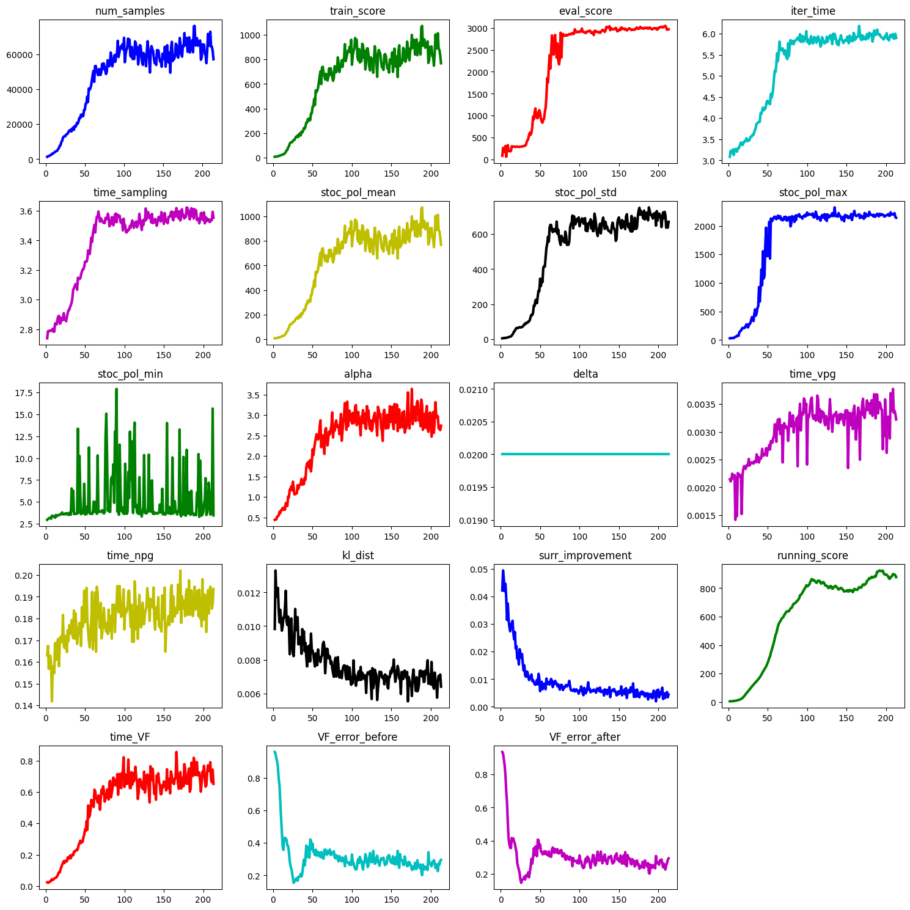

# MOReL : Model Based Offline RL

The MOReL code is built directly on top of the MJRL framework. To run the MOReL code, please follow the below steps. Please read all the steps in full before proceeding.

## Code Setup
Currently, MOReL requires use of `mjrl-v2` which can be installed by following the instructions [here](https://github.com/aravindr93/mjrl/tree/v2/setup). Note importantly that you have to be on the `v2` branch.

## Running D4RL domains

To run MOReL with the [d4rl](https://sites.google.com/view/d4rl/home) domains, first install the d4rl package ([click here for instructions](https://github.com/rail-berkeley/d4rl)). Subsequently, we will follow the steps below.

- **Dataset Setup :** After setting up `mjrl` and `d4rl`, we first need to format the `d4rl` dataset into a format that is utilized in `mjrl`. To do this, we can use the provided `prep_d4rl_dataset.py` script. The dataset format we expect is a list of trajectories, where each trajectory is a dictionary with keys: `observations, actions, rewards`. A more detailed description of dataset format can be found [here](https://github.com/aravindr93/mjrl/blob/v2/mjrl/samplers/core.py). To obtain the `hopper-medium-v0` dataset, execute the following command.
```
python prep_d4rl_dataset.py --env_name hopper-medium-v0 --include ../model_based_npg/utils/reward_functions/gym_hopper.py --output datasets/hopper-medium-v0.pickle
```

- **Learning the Dynamics Model Ensemble :** Once we have the dataset, we can learn a neural network dynamics model by executing the below command. 
```
CUDA_VISIBLE_DEVICES=0 python learn_model.py --config configs/d4rl_hopper_medium.txt --output hopper-medium-v0-models.pickle
```
 
- **Run MOReL :** Finally, once the ensemble of models have been learned (see previous step), we can turn to learning a policy using the MOReL algorithm. Before doing so, ensure that the path to the learned dynamics model is correctly specified in the config file. After ensuring this, execute the below command:
```
CUDA_VISIBLE_DEVICES=0 python run_morel.py --config configs/d4rl_hopper_medium.txt --output hopper-medium-v0-example
```


## Understanding the Interpreting the Results

- The job directory (`hopper-medium-v0-example` in the above example) will contain experiment logs as well as periodic saving of learned policies. The experiment results can be quickly explored by using a plotting script included with `mjrl`.
```
python ../../mjrl/utils/explore_results.py --output hopper-medium-v0-example/plot.png --data hopper-medium-v0-example/logs/log.pickle
```

- An example of the resulting plot is below. In the plot, `train_score` refers to the policy performance in the pessimistic MDP and `eval_score` refers to the value in the environment (unknown underlying MDP).

<td></td>

- Below are the normalized scores of MOReL across all the gym tasks in the D4RL benchmark. For full details, see the [paper](https://sites.google.com/view/morel).

<td></td>

## Running BRAC domains
The first set of expeirments in MOReL follows the same dataset protocol as the [BRAC](https://arxiv.org/abs/1911.11361) paper. Here, we train policies to an intermediate level of performance. This partially trained policy in addition to different types of exploratory noise is used to collect the offline dataset. Please refer to the [BRAC](https://arxiv.org/abs/1911.11361) and [MOReL](https://sites.google.com/view/morel) papers for more details.

- **Dataset Collection :** After setting up `mjrl`, we first need to collect a dataset for offline RL. To do this, we can use the `collect_dataset.py` script. The dataset format we expect is a list of trajectories, where each trajectory is a dictionary with keys: `observations, actions, rewards`. A more detailed description of dataset format can be found [here](https://github.com/aravindr93/mjrl/blob/v2/mjrl/samplers/core.py). As a quick example, execute the below command from this directory (where the readme is located). This will collect a dataset of 10000 transitions using a logging policy. In typical experiments, it is common to use about 1 million samples, which can take 5-10 mins to collect depending on compute infrastructure. We will use a smaller dataset for sake of a quick example.
```
python collect_dataset.py --env_name Hopper-v3 --policy logging_policy/hopper_v3.pickle --output datasets/hopper_v3_dataset.pickle --size 10000 --act_repeat 2 --include "../model_based_npg/utils/reward_functions/gym_hopper.py"
```

- **Learning the Dynamics Model Ensemble :** Once we have the dataset, we can learn a neural network dynamics model by executing the below command. 
```
CUDA_VISIBLE_DEVICES=0 python learn_model.py --config configs/hopper_v3_morel.txt --output hopper-v3-models.pickle
```
 
- **Run MOReL :** Finally, once the ensemble of models have been learned (see previous step), we can turn to learning a policy using the MOReL algorithm. Before doing so, ensure that the path to the learned dynamics model is correctly specified in the config file. After ensuring this, execute the below command:
```
CUDA_VISIBLE_DEVICES=0 python run_morel.py --config configs/hopper_v3_morel.txt --output Hopper-v3-morel-example
```

- **Visualizing Results :** The results of the experiment can be visualized similar to the case of D4RL tasks. See the `Understanding the Interpreting the Results` section above for details.


## Bibliography

If you use the code in MOReL and `mjrl` in general, please cite the below papers.
```
@INPROCEEDINGS{Kidambi-MOReL-20,
    AUTHOR    = {Rahul Kidambi AND Aravind Rajeswaran AND Praneeth Netrapalli AND Thorsten Joachims},
    TITLE     = "{MOReL : Model-Based Offline Reinforcement Learning}",
    BOOKTITLE = {NeurIPS},
    YEAR      = {2020},
}

@INPROCEEDINGS{Rajeswaran-Game-MBRL,
    AUTHOR    = {Aravind Rajeswaran AND Igor Mordatch AND Vikash Kumar},
    TITLE     = "{A Game Theoretic Framework for
Model-Based Reinforcement Learning}",
    BOOKTITLE = {ICML},
    YEAR      = {2020},
}

@INPROCEEDINGS{Rajeswaran-RSS-18,
    AUTHOR    = {Aravind Rajeswaran AND Vikash Kumar AND Abhishek Gupta AND
                 Giulia Vezzani AND John Schulman AND Emanuel Todorov AND Sergey Levine},
    TITLE     = "{Learning Complex Dexterous Manipulation with Deep Reinforcement Learning and Demonstrations}",
    BOOKTITLE = {Proceedings of Robotics: Science and Systems (RSS)},
    YEAR      = {2018},
}
```