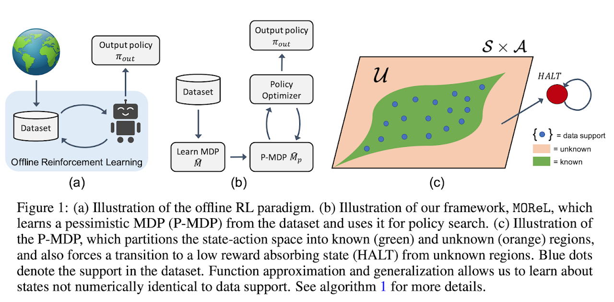

# MOReL : Model Based Offline RL

<td></td>

The MOReL code is built directly on top of the MJRL framework. To run the MOReL code, please follow the below steps. Please read all the steps in full before proceeding.

1. Setup `mjrl` -- currently, MOReL requires use of `v2.0` of `mjrl` which can be installed by following the instructions [here](https://github.com/aravindr93/mjrl/tree/v2/setup). Note importantly that you have to be on the `v2` branch.

2. After setting up `mjrl`, we first need to collect a dataset for offline RL. To do this, we can use the `collect_dataset.py` script. The dataset format we expect is a list of trajectories, where each trajectory is a dictionary with keys: `observations, actions, rewards`. A more detailed description of dataset format can be found [here](https://github.com/aravindr93/mjrl/blob/v2/mjrl/samplers/core.py). 

3. As a quick example, execute the below command from this directory (where the readme is located). This will collect a dataset of 10000 transitions using a logging policy. In typical experiments, it is common to use about 1 million samples, which can take 5-30 mins to collect depending on compute infrastructure. We will use a smaller dataset for sake of a quick example.
```
python collect_dataset.py --env_name Hopper-v3 --policy logging_policy/hopper_v3.pickle --output datasets/hopper_v3_dataset.pickle --size 10000 --act_repeat 2 --include "../model_based_npg/utils/reward_functions/gym_hopper.py"
```

4. Once the model is learned, we can run the MOReL code. All hyperparameters and configurations are set in a config file. Examples are provided in the `configs` directory. This includes specification of neural network size, number of epochs, degree of pessimism etc. The path to the dataset, as well as any pre-trained dynamics model, are specified in the config file directly. We can run an experiment with the below command:
```
CUDA_VISIBLE_DEVICES=0 python run_morel.py --output Hopper-v3-morel-example --config configs/hopper_v3_morel.txt
```

5. The job directory (`Hopper-v3-morel-example` in the above example) will contain experiment logs as well as periodic saving of learned policies. The experiment results can be quickly explored by using a plotting script included with `mjrl`.
```
python ../../mjrl/utils/explore_results.py --output Hopper-v3-morel-example/plot.png --data Hopper-v3-morel-example/logs/log.pickle
```

6. An example of the resulting plot is below (this was obtained with a larger dataset). In the plot, `train_score` refers to the policy performance in the pessimistic MDP and `eval_score` refers to the value in the environment (unknown underlying MDP).

<td></td>

## Bibliography

If you use the code in MOReL and `mjrl` in general, please cite the below papers.
```
@INPROCEEDINGS{Kidambi-MOReL-20,
    AUTHOR    = {Rahul Kidambi AND Aravind Rajeswaran AND Praneeth Netrapalli AND Thorsten Joachims},
    TITLE     = "{MOReL : Model-Based Offline Reinforcement Learning}",
    BOOKTITLE = {NeurIPS},
    YEAR      = {2020},
}

@INPROCEEDINGS{Rajeswaran-NIPS-17,
    AUTHOR    = {Aravind Rajeswaran and Kendall Lowrey and Emanuel Todorov and Sham Kakade},
    TITLE     = "{Towards Generalization and Simplicity in Continuous Control}",
    BOOKTITLE = {NIPS},
    YEAR      = {2017},
}

@INPROCEEDINGS{Rajeswaran-RSS-18,
    AUTHOR    = {Aravind Rajeswaran AND Vikash Kumar AND Abhishek Gupta AND
                 Giulia Vezzani AND John Schulman AND Emanuel Todorov AND Sergey Levine},
    TITLE     = "{Learning Complex Dexterous Manipulation with Deep Reinforcement Learning and Demonstrations}",
    BOOKTITLE = {Proceedings of Robotics: Science and Systems (RSS)},
    YEAR      = {2018},
}
```